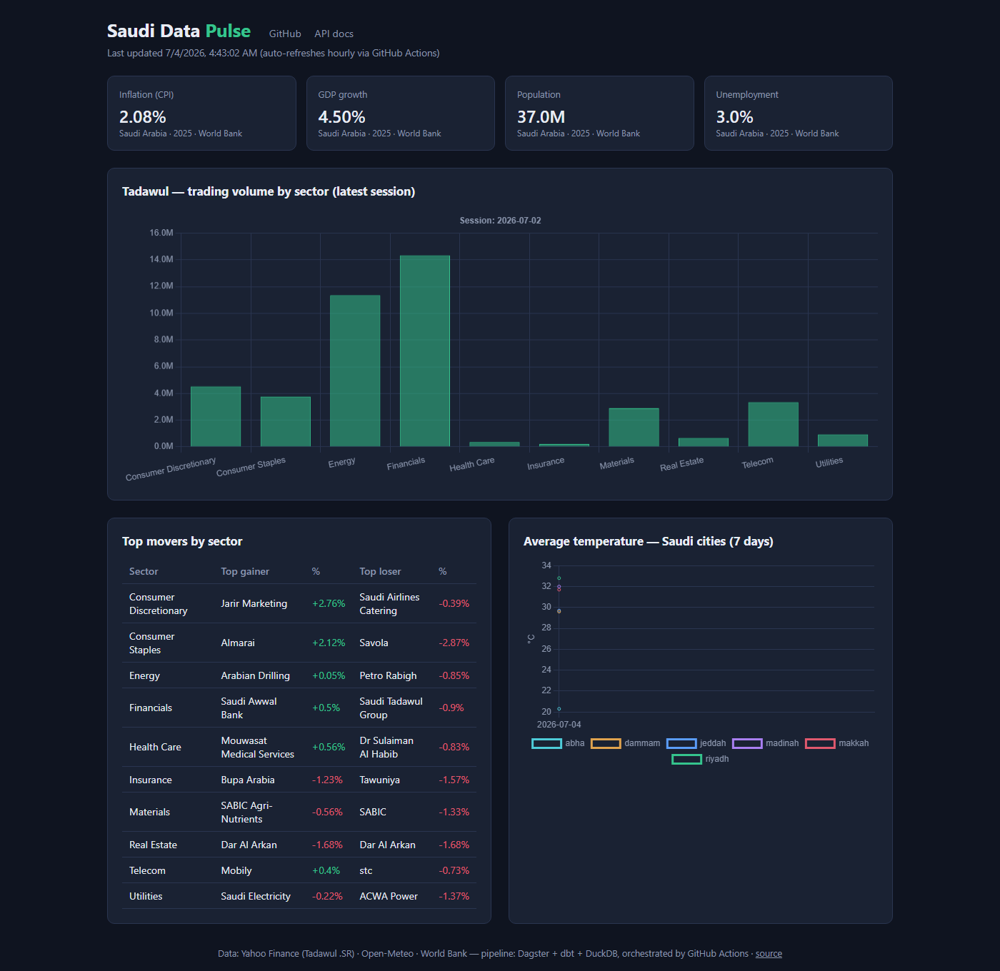

# Saudi Data Pulse

[](https://github.com/akaD1D/saudi-data-pulse/actions/workflows/ci.yml)

A real-time analytics platform for Saudi open data. It continuously ingests
**Tadawul stock market data**, **hourly weather for 6 Saudi cities**, and
**Saudi macroeconomic indicators**, runs them through a lakehouse-style
pipeline, and serves live dashboards and a public JSON API.

## 🔴 Live

- **Dashboard**: https://akad1d.github.io/saudi-data-pulse/ — live charts, refreshed hourly
- **dbt docs**: https://akad1d.github.io/saudi-data-pulse/dbt/ — every model, column, test, and the lineage graph
- **API**: hosted on a Hugging Face Space (interactive docs at `/docs`)
- **Data**: the [`data` branch](https://github.com/akaD1D/saudi-data-pulse/tree/data) holds the Parquet lake, DuckDB warehouse, and JSON exports, updated by [scheduled GitHub Actions runs](https://github.com/akaD1D/saudi-data-pulse/actions/workflows/pipeline.yml)

[](https://akad1d.github.io/saudi-data-pulse/)

The platform runs in two modes with the **same asset definitions**:
local (Docker Compose: Dagster daemon + UI, Metabase, MinIO) and cloud
(GitHub Actions invokes the identical Dagster assets on cron — $0 hosting).

Built to demonstrate production data-engineering practices end to end:
asset-based orchestration, ELT with tested transformations, data-quality
gates that block bad data, and infrastructure as code.

## Architecture

Design decisions, trade-offs, and measured performance numbers live in
[ARCHITECTURE.md](ARCHITECTURE.md).

```
yfinance (.SR tickers)     World Bank API (SAU)      Open-Meteo (6 cities)
   daily, partitioned         weekly snapshot            hourly
        │                              │                        │
        └──────────────┬───────────────┴────────────────────────┘
                       ▼
              Dagster ingestion assets
                       │
                       ▼
        Data lake — raw zone (Parquet, partitioned by date)
          local folder / MinIO (Docker) / S3 (prod)
                       │
                       ▼
              dbt on DuckDB  ──  staging views + data-quality tests
                       │            (failing tests block the marts)
                       ▼
              analytics marts (daily_market_summary, …)
                       │
            ┌──────────┴──────────┐
            ▼                     ▼
     Metabase dashboards    FastAPI read API
```

Orchestration is **Dagster** (asset-based; the concepts map 1:1 to Airflow
DAGs). Transformations are **dbt** with the DuckDB adapter. Everything is
addressed through two env vars (`DATA_LAKE_PATH`, `DUCKDB_PATH`) so the same
code runs on a laptop, in Docker Compose, or on a cloud VM.

## Quickstart (native, no Docker)

```powershell
python -m venv .venv
.venv\Scripts\Activate.ps1          # source .venv/bin/activate on Linux/macOS
pip install -e ".[dev]"
cd transform && dbt deps --profiles-dir . && cd ..

# Ingest one trading day (any partition since 2026-01-01 can be backfilled)
dagster asset materialize --select "lake/tadawul_prices" --partition 2026-07-02 -m orchestration.definitions

# Ingest weather + macro indicators, then build marts + quality gates
dagster asset materialize --select "lake/weather_hourly,lake/econ_indicators,stg_tadawul_prices+,stg_weather+,stg_econ_indicators+" -m orchestration.definitions

# Explore the asset graph / schedules in the Dagster UI
dagster dev                          # http://localhost:3000

# Serve the API
uvicorn api.main:app                 # http://localhost:8000/docs
```

## Quickstart (Docker)

```bash
docker compose up --build
```

- Dagster UI → http://localhost:3000 (materialize all assets from the UI)
- API → http://localhost:8000/docs
- Metabase → http://localhost:3001 (add the [DuckDB community driver](https://github.com/motherduckdb/metabase_duckdb_driver) jar to `./metabase-plugins/` first, then connect it to `/data/warehouse.duckdb`)
- MinIO console → http://localhost:9001 (`minioadmin`/`minioadmin`) — in Docker the lake is real object storage: Dagster writes `s3://lake/...` through s3fs and dbt/DuckDB reads it back through httpfs, the same code path an AWS S3 deployment would use

## API

| Endpoint | Description |
| --- | --- |
| `GET /api/v1/market/summary` | Per-sector daily performance (volume, avg move, top gainer/loser) |
| `GET /api/v1/market/prices/{ticker}` | Recent daily OHLCV for one ticker, e.g. `2222.SR` |
| `GET /api/v1/weather/{city}` | Recent hourly observations, e.g. `riyadh`, `jeddah`, `dammam` |
| `GET /api/v1/econ` | Latest Saudi macro indicators (CPI, GDP growth, population, unemployment) |

## Project layout

```
orchestration/   Dagster assets, resources, schedules
transform/       dbt project (staging + marts + data-quality tests)
api/             FastAPI read API over the DuckDB warehouse
docs/            GitHub Pages dashboard (static, Chart.js)
scripts/         JSON export for the dashboard
```

## Roadmap

- [x] Phase 1 — Tadawul ingestion → dbt marts → dashboard/API, daily schedule
- [x] Phase 2 — weather (Open-Meteo) + macro indicators (World Bank) sources, daily-partitioned ingestion with backfills, dbt-expectations quality gates, failure alerting via webhook
- [x] Phase 3 — public deployment at $0: GitHub Actions cron pipeline → `data` branch → GitHub Pages dashboard + Hugging Face Space API
- [x] Phase 3.5 — S3-compatible lake backend: Docker mode writes/reads the lake via MinIO (s3fs + DuckDB httpfs), switchable to AWS S3 with env vars only
- [x] Phase 4 — hosted [dbt docs](https://akad1d.github.io/saudi-data-pulse/dbt/), [architecture write-up](ARCHITECTURE.md) with measured cost/latency numbers
- [ ] Phase 5 (optional) — Terraform deploy to an always-on VM (full Dagster UI + Metabase in the cloud), HTTPS, uptime monitoring

## Development

```bash
ruff check .          # lint
pytest                # unit tests
cd transform && dbt build --profiles-dir .   # models + data tests
```

CI (GitHub Actions) runs lint, unit tests, and a dbt compile check on every push.
